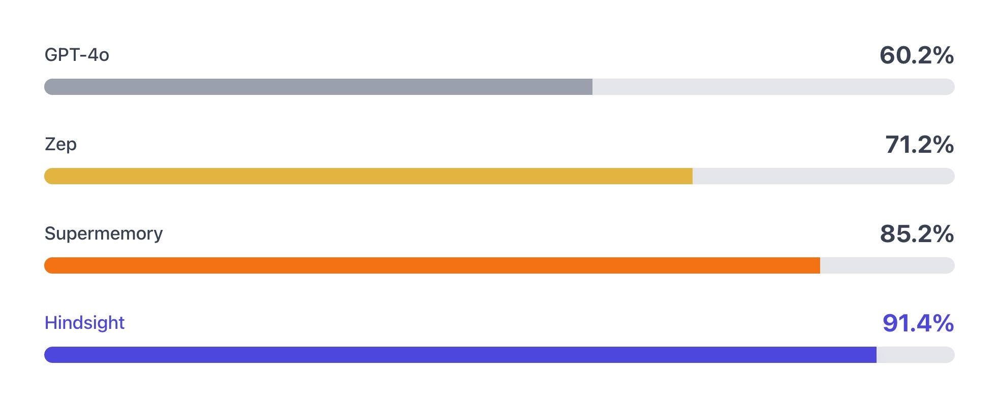

<div align="center">


[Documentation](https://vectorize-io.github.io/hindsight) • [Paper](https://arxiv.org/abs/2512.12818) • [Examples](https://github.com/vectorize-io/hindsight-cookbook)

[](https://github.com/vectorize-io/hindsight/actions/workflows/release.yml)
[](https://opensource.org/licenses/MIT)
[](https://pypi.org/project/hindsight-api/)
[](https://pypi.org/project/hindsight-client/)
[](https://www.npmjs.com/package/@vectorize-io/hindsight-client)
[](https://join.slack.com/t/hindsight-space/shared_invite/zt-3klo21kua-VUCC_zHP5rIcXFB1_5yw6A)


</div>

---

## What is Hindsight?

Hindsight™ is an agent memory system built to create smarter agents that learn over time. It eliminates the shortcomings of alternative techniques such as RAG and knowledge graph and delivers state-of-the-art performance on long term memory tasks.

Hindsight addresses common challenges that have frustrated AI engineers building agents to automate tasks and assist users with conversational interfaces. Many of these challenges stem directly from a lack of memory.

- **Inconsistency:** Agents complete tasks successfully one time, then fail when asked to complete the same task again. Memory gives the agent a mechanism to remember what worked and what didn't and to use that information to reduce errors and improve consistency.
- **Hallucinations:** Long term memory can be seeded with external knowledge to ground agent behavior in reliable sources to augment training data.
- **Cognitive Overload:** As workflows get complex, retrievals, tool calls, user messages and agent responses can grow to fill the context window leading to context rot. Short term memory optimization allows agents to reduce tokens and focus context by removing irrelevant details.

## How is Hindsight Different From Other Memory Systems?


Most agent memory implementation rely on basic vector search or sometimes use a knowledge graph. Hindsight uses biomimetic data structures to organize agent memories in a way that is more like how human memory works:

- **World:** Facts about the world ("The stove gets hot")
- **Experiences:** Agent's own experiences ("I touched the stove and it really hurt")
- **Opinion:** Beliefs with confidence scores ("I shouldn't touch the stove again" - .99 confidence)
- **Observation:** Complex mental models derived by reflecting on facts and experiences ("Curling irons, ovens, and fire are also hot. I shouldn't touch those either.")

Memories in Hindsight are stored in banks (i.e. memory banks). When memories are added to Hindsight, they are pushed into either the world facts or experiences memory pathway. They are then represented as a combination of entities, relationships, and time series with sparse/dense vector representations to aid in later recall.

Hindsight provides three simple methods to interact with the system:

- **Retain:** Provide information to Hindsight that you want it to remember
- **Recall:** Retrieve memories from Hindsight
- **Reflect:** Reflect on memories and experiences to generate new observations and insights from existing memories.

### Agent Memory That Learns

A key goal of Hindsight is to build agent memory that enables agents to learn and improve over time. This is the role of the `reflect` operation which provides the agent to form broader opinions and observations over time.

For example, imagine a product support agent that is helping a user troubleshoot a problem. It uses a `search-documentation` tool it found on an MCP server. Later in the conversation, the agent discovers that the documentation returned from the tool wasn't for the product the user was asking about. The agent now has an experience in its memory bank. And just like humans, we want that agent to learn from its experience.

As the agent gains more experiences, `reflect` allows the agent to form observations about what worked, what didn't, and what to do differently the next time it encounters a similar task.

---

## Memory Performance & Accuracy

Hindsight has achieved state-of-the-art performance on the LongMemEval benchmark, widely used to assess memory system performance across a variety of conversational
AI scenarios. The current reported performance of Hindsight and other agent memory solutions as of December 2025 is shown here:



The benchmark performance data for Hindsight and GPT-4o (full context) have been reproduced by research collaborators at the Virginia Tech [Sanghani Center for Artificial Intelligence and Data Analytics](https://sanghani.cs.vt.edu/) and The Washington Post. Other scores are self-reported by software vendors.

A thorough examination of the techniques implemented in Hindsight and detailed breakdowns of benchmark performance are [available on arXiv](https://arxiv.org/abs/2512.12818). This research is currently being prepared for conference submission and the wider peer review process.

The benchmark results from this research can be inspected in our [visual benchmark explorer](https://hindsight-benchmarks.vercel.app). As additional improvements are made to Hindsight, new benchmark data will be available for review using this same tool.

## Quick Start

### Docker (recommended)

```bash
export OPENAI_API_KEY=your-key

docker run --rm -it --pull always -p 8888:8888 -p 9999:9999 \
  -e HINDSIGHT_API_LLM_API_KEY=$OPENAI_API_KEY \
  -e HINDSIGHT_API_LLM_MODEL=o3-mini \
  -v $HOME/.hindsight-docker:/home/hindsight/.pg0 \
  ghcr.io/vectorize-io/hindsight:latest
```

API: http://localhost:8888  
UI: http://localhost:9999

Install client:

```bash
pip install hindsight-client -U
# or
npm install @vectorize-io/hindsight-client
```

Python example:

```python
from hindsight_client import Hindsight

client = Hindsight(base_url="http://localhost:8888")

# Retain: Store information
client.retain(bank_id="my-bank", content="Alice works at Google as a software engineer")

# Recall: Search memories
client.recall(bank_id="my-bank", query="What does Alice do?")

# Reflect: Generate disposition-aware response
client.reflect(bank_id="my-bank", query="Tell me about Alice")
```

### Python (embedded, no Docker)

```bash
pip install hindsight-all -U
```

```python
import os
from hindsight import HindsightServer, HindsightClient

with HindsightServer(
    llm_provider="openai",
    llm_model="gpt-5-mini", 
    llm_api_key=os.environ["OPENAI_API_KEY"]
) as server:
    client = HindsightClient(base_url=server.url)
    client.retain(bank_id="my-bank", content="Alice works at Google")
    results = client.recall(bank_id="my-bank", query="Where does Alice work?")
```

### Node.js / TypeScript

```bash
npm install @vectorize-io/hindsight-client
```

```javascript
const { HindsightClient } = require('@vectorize-io/hindsight-client');

const client = new HindsightClient({ baseUrl: 'http://localhost:8888' });

await client.retain('my-bank', 'Alice loves hiking in Yosemite');
await client.recall('my-bank', 'What does Alice like?');
```

---

## Architecture & Operations

### Retain

The `retain` operation is used to push new memories into Hindsight. It tells Hindsight to _retain_ the information you pass in as an input.

```python
from hindsight_client import Hindsight

client = Hindsight(base_url="http://localhost:8888")

# Simple
client.retain(
    bank_id="my-bank",
    content="Alice works at Google as a software engineer"
)

# With context and timestamp
client.retain(
    bank_id="my-bank",
    content="Alice got promoted to senior engineer",
    context="career update",
    timestamp="2025-06-15T10:00:00Z"
)
```

Behind the scenes, the retain operation uses an LLM to extract key facts, temporal data, entities, and relationships. It passes these through a normalization process to transform extracted data into canonical entities, time series, and search indexes along with metadata. These representations create the pathways for accurate memory retrieval in the recall and reflect operations. 


### Recall

The recall operation is used to retrieve memories. These memories can come from any of the memory types (world, experiences, etc.)

```python
from hindsight_client import Hindsight

client = Hindsight(base_url="http://localhost:8888")

# Simple
client.recall(bank_id="my-bank", query="What does Alice do?")

# Temporal
client.recall(bank_id="my-bank", query="What happened in June?")
```

Recall performs 4 retrieval strategies in parallel:
- Semantic: Vector similarity
- Keyword: BM25 exact matching
- Graph: Entity/temporal/causal links
- Temporal: Time range filtering


The individual results from the retrievals are merged, then ordered by relevance using reciprocal rank fusion and a cross-encoder reranking model.

The final output is trimmed as needed to fit within the token limit.

### Reflect

The reflect operation is used to perform a more thorough analysis of existing memories. This allows the agent to form new connections between memories which are then persisted as opinions and/or observations. When building agents, the reflect operation is a key capability to enable the agent to learn from its experiences. 

For example, the `reflect` operation can be used to support use cases such as:

- An **AI Project Manager** reflecting on what risks need to be mitigated on a project.
- A **Sales Agent** reflecting on why certain outreach messages have gotten responses while others haven't.
- A **Support Agent** reflecting on opportunities where customers have questions not answered by current product documentation.

The `reflect` operation can also be used to handle on-demand question answering or analysis which require more deep thinking.

```python
from hindsight_client import Hindsight

client = Hindsight(base_url="http://localhost:8888")

client.reflect(bank_id="my-bank", query="What should I know about Alice?")
```


---

## Resources

**Documentation:** 
- [https://hindsight.vectorize.io](https://hindsight.vectorize.io)

**Clients:**
- [Python](http://hindsight.vectorize.io/sdks/python)
- [Node.js](http://hindsight.vectorize.io/sdks/nodejs)
- [REST API](https://hindsight.vectorize.io/api-reference)
- [CLI](https://hindsight.vectorize.io/sdks/cli)

**Community:**
- [Slack](https://join.slack.com/t/hindsight-space/shared_invite/zt-3klo21kua-VUCC_zHP5rIcXFB1_5yw6A)
- [GitHub Issues](https://github.com/vectorize-io/hindsight/issues)

---
## Star History

[](https://www.star-history.com/#vectorize-io/hindsight&type=date&legend=top-left)
---

## Contributing

See [CONTRIBUTING.md](./CONTRIBUTING.md).

## License

MIT — see [LICENSE](./LICENSE)

---

Built by [Vectorize.io](https://vectorize.io)
